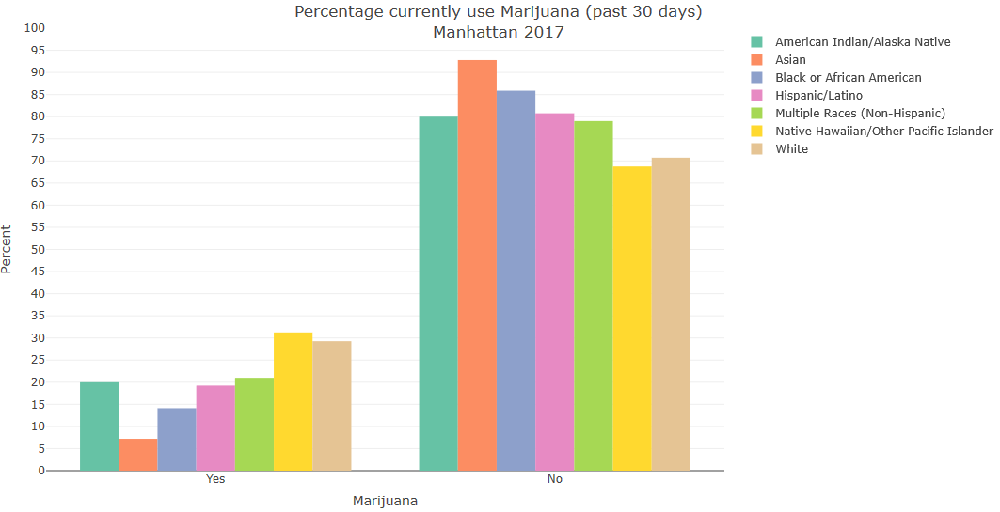
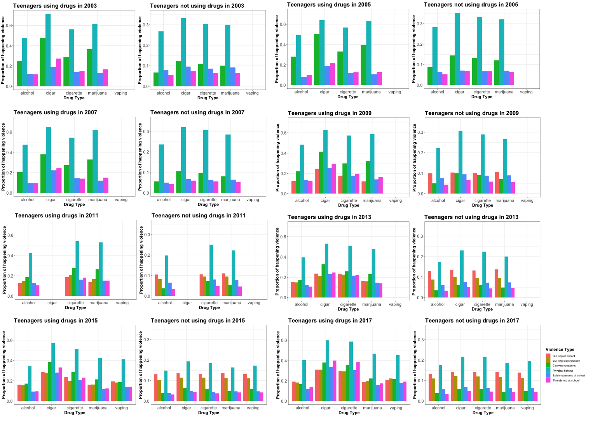

# EDA

This section shows the exploratory analyses that we have done for this project.  

 

## Interpretation of vaping & drug use plots 

 

 

* We first looked at the proportion of five different types of drug use: alcohol, cigarette, cigar, marijuana and vaping. Alcohol has the highest proportion in year 2003, but started decreasing from 2007 across five boroughs in NYC. Cigarette also showed the same pattern over the years after 2009. 

* Cigar use showed a little peak in year 2013, otherwise stayed persistently low proportion for all five boroughs in NYC. 

* Statent Island had highest Marijuana use over the years among five boroughs in NYC. However, in year 2017, it dropped dramatically and had the lowest proportion among all boroughs. Moreover, the marijuana users in Manhattan increase from the lowest level to highest level among five boroughs during 2007-2011. 

* Although we only have data from 2015 and 2017, our intestered substance - vaping showed the highest usage among youths in all boroughs comparing to other drugs. And it is increasing rapidly in year 2017, which indicates that vaping is growing into a new drug and is threatening public health in our youth.

The following animated graphs shows how differnt drug use changes over time in NYC's youth. 
These graphs are presented to answer the question: _How did mental health related issues in youth change over time in NYC?_

If you are interested in more details, please visit our [Report](Report.html).
   

## Interpretation of mental health plots

 

 

* Above three mental health problems are related to vaping and other drug use in the report/survey. The mood problem: feeling sad and hopeless, has the highest level among three problems. A large number of teenagers reported depressed mood and the trend decreases slightly after 2009. Staten Island keeps the lowest proportion in the reported sadness except 2011. Bronx almost keeps the highest level and Queens fluctuates heavily which decreases a lot during 2005 to 2011. 

* The proportion of attempted suicide holds the level near 0.1 and is higher than that of getting injured due to the attempted suicide. Both of attempted suicide and injurious attempted suicide keep the relative steady trend in proportion and the same level across five boroughs. 

This section's graphs are combined into an animated one to answer the question:
_How did mental health related issues in youth change over time in NYC?_

If you are interested in more details, please visit our [Report](Report.html).
   

## The demographics of vaping and drug use by gender, races and ages

 

This section's graphs are combined into an animated one to answer the question:
_How does drug use and mental health status differ by demographics in NYC youth?_

### drug use grouped by the gender in 2017

 

 

This is an example plot showing the condition of the marijuana and vaping use in the NYC grouped by the gender. 

### drug use grouped by the races in 2017

 

 

This is an example plot showing the condition of marijuana and vaping use in NYC grouped by races.

### drug use grouped by the ages in 2017

 

 

This is an example plot showing the condition of marijuana and vaping use in NYC grouped by ages

If you are interested in more details, please visit our [Explore the Data](https://dani-quigee-shiny.shinyapps.io/My_first_Shiny/#section-drug-use).
   

## interpretation of violence & risky behaviors plots

 

 

* The left plot has the twice value than the right plot when the bar is in the same height. Therefore, the proportion of having violence and risky behaviors in the teenagers who use drugs is nearly twice than the that in the teenagers who are non-drug users. Moreover, non-drug users have lower proportion in carrying weapons from 2003 to 2017. 

* Physical fighting, feeling unsafe at school and being treantened at school increase in proportion during 2005-2007, keep the same proportion in 2009,  and begin to decrease in 2011. 

* Physical fighting keeps high proportion in both drug users and non-drug users and becomes a issue which is hard to control and intervent in 2003-2017. 

* Bullying electronically is another issue whose proportion inceases from 2015 to 2017 in both two groups

This section's graphs are combined into one animated one to answer the question:
_How does risky and violent behaviors differ between NYC children using drugs and not using drugs?_

If you are interested in more details, please visit our [Report](Report.html).

