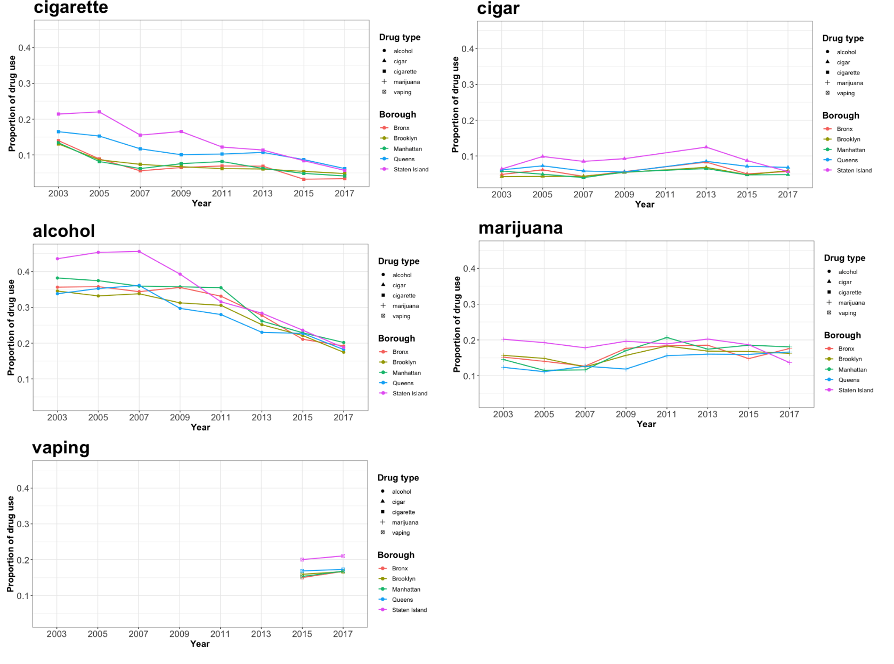
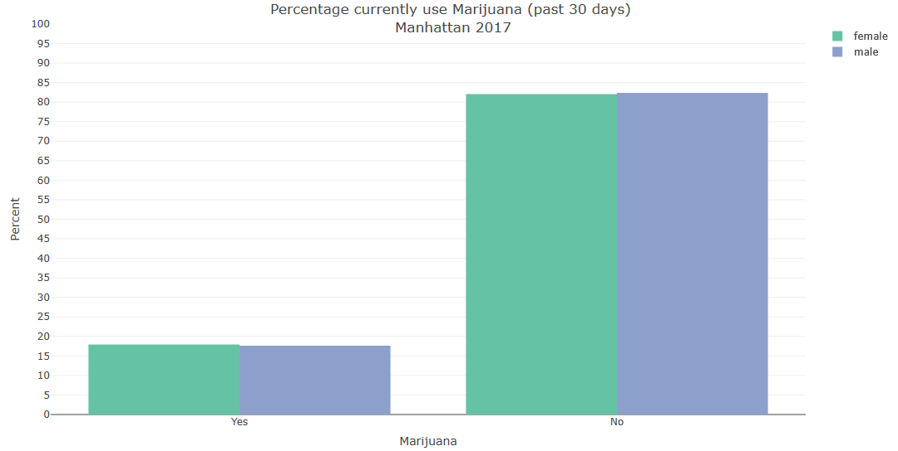
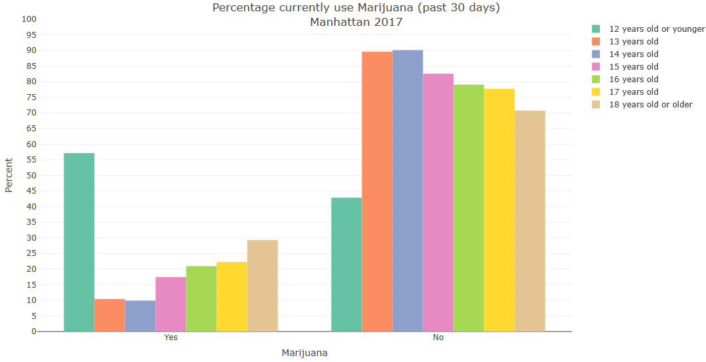

# EDA

In this page, we will give you interpretation of the plot and the corresponding question each graph answers.

## Interpretation of vaping & drug use plots 

 

* Among five kinds of drugs(vaping), alcohol holds the highest proportion but decreases in use from 2007 across five boroughs in NYC. In addition, cigarette has a lower total proportion than alcohol but the similar decreasing trend after 2009. 

* Cigar maintains the steady but low-proportion trend during 2003-2017, which could be compared with marijuana holding steady but higher proportion in total. Moreover, the marijuana users in Manhattan increase from the lowest level to highest level among five boroughs during 2007-2011. 

* Vaping, which is our target subject, hold the increasing trend from 2015-2017. This trend is quite similar to the alcohol, cigar and cigarette before being intervented, and maintains at the same proportion level with marijuana in 2015-2017, which indicates that it can grow into a new drug threatening the public health.

This section's graphs are combined into an animated one to answer the question: 
_How did drugs use change over time in NYC's youth?_

If you are interested in more details, please visit our [Report](Report.html).

## Interpretation of mental health plots

 

* Above three mental disorders are related to the vaping and other drug use in the report/survey. The emotion issue, feeling sad and hopeless, hold the highest level among three metal disorders. The data shows large number of teenagers do not have a positive mood based on the participants attending the report, and the trend decreases slightly after 2009. Staten Island keeps the lowest proportion in the reported sadness except 2011. Bronx almost keeps the highest level and Queens fluctuates heavily which decreases a lot during 2005 to 2011. 

* The proportion of attempted suicide holds the level near 0.1 and is higher than that of getting injured due to the attempted suicide. Both of attempted suicide and injurious attempted suicide keep the relative steady trend in proportion and the same level across five boroughs. 

This section's graphs are combined into an animated one to answer the question:
_How did mental health related issues in youth change over time in NYC?_

If you are interested in more details, please visit our [Report](Report.html).

## The demographics of vaping and drug use by gender, races and ages

This section's graphs are combined into an animated one to answer the question:
_How does drug use and mental health status differ by demographics in NYC youth?_

### drug use grouped by the gender in 2017

 

This is an example plot showing the condition of the marijuana and vaping use in the NYC grouped by the gender. 

### drug use grouped by the races in 2017

 

This is an example plot showing the condition of marijuana and vaping use in NYC grouped by races.

### drug use grouped by the ages in 2017

 

This is an example plot showing the condition of marijuana and vaping use in NYC grouped by ages

If you are interested in more details, please visit our [Explore the Data](https://dani-quigee-shiny.shinyapps.io/My_first_Shiny/#section-drug-use).

## interpretation of violence & risky behaviors plots

 

* The left plot has the twice value than the right plot when the bar is in the same height. Therefore, the proportion of having violence nad risky behaviors in the teenagers who use drugs is nearly twice than the that in the teenagers who are non-drug users. Moreover, non-drug users have lower proportion in carrying weapons from 2003 to 2017. 

* Physical fighting, feeling unsafe at school and being treantened at school increase in proportion during 2005-2007, keep the same proportion in 2009,  and begin to decrease in 2011. 

* Physical fighting keeps high proportion in both drug users and non-drug users and becomes a issue which is hard to control and intervent in 2003-2017. 

* Bullying electronically is another issue whose proportion inceases from 2015 to 2017 in both two groups

This section's graphs are combined into one animated one to answer the question:
_How does risky and violent behaviors differ between NYC children using drugs and not using drugs?_

If you are interested in more details, please visit our [Report](Report.html).

