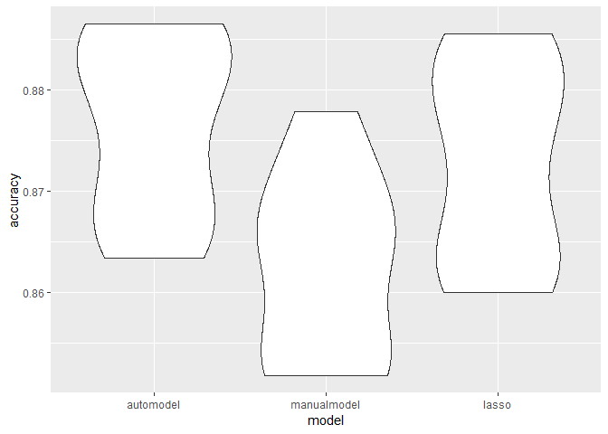

Logistic Regression
================
Daniela Quigee (dq2147)
12/01/2019

``` r
# Loading the cleaned data
load("./data/nyc_data.RData")
fill_NA = function(vector){
    as.factor(coalesce(as.character(vector),"unknown"))
}
set.seed(8105)
```

\#\#\#Manual selection

## Function definition

The following code chunck define the functions that is gonna be used to
generate and mapped on the cv dataframe, i.e. it build up the component
of the pipeline.

``` r
###Function that do auto log reg

## function for cv
#crossv_mc(df,n)

## function for autologreg
log_reg_auto = function(cv_df,formular = manual_formular){
  cv_df %>%mutate(
###Automodel selection with AIC as criterial
         automodel  = map(train, ~glm(current_vaping ~., data = .x, family = binomial(),na.action = na.exclude)%>%MASS::stepAIC(trace = FALSE))
 ) }


###Do lasso stat learning
lasso = function(cv_df){
  lasso_temp = cv.glmnet(current_vaping ~., data = cv_df, family = "binomial")
glmnet(current_vaping ~., data = cv_df, family = "binomial",lambda = lasso_temp$lambda.min)
}

###find prediction accuracy
accy = function(model,data){
  Temp = predict(model, data, type = "response")%>%round()
1-mean(Temp-(as.numeric(pull(as.tibble(data),current_vaping))-1))
  }
```

## data input selection:

This part control the datas that was used to feed in the pipeline

``` r
# Extracting necessary variables
df = df_total%>%
  select(
    # binary respone
    current_vaping,
    # possible predictor
    carring_weapon,
    sad_hopeless,
    attempted_suicide,
    injurious_suicide_attempt,
    safety_concerns_at_school,
    threatened_at_school,
    physical_fighting,
    bullying_at_school,
    bullying_electronically,
    sex,
    age,
    race7,
    borough,
    illegal_injected_drug_use,
sex_before_13,
multiple_sex_partner,
sexual_contact_2
,year)


df1517 = df%>%filter(year == 2015|year == 2017)%>%na.omit()
df15 = df%>%filter(year == 2017)%>%na.omit()
df17 = df%>%filter(year == 2015)%>%na.omit()
```

### Actual pipeline

The following part commbine all the component of the pipelines and feed
the table.

``` r
###Set the manual selected predictor and response for the manual model
manual_formular = current_vaping ~ sad_hopeless + attempted_suicide  + safety_concerns_at_school + threatened_at_school + physical_fighting + bullying_electronically + carring_weapon + year

### run the actual pipeline
regtb_1517=
  ## CV 
  crossv_mc(df1517,n=10)%>%
  ##stepAIC
  log_reg_auto()%>%
  ## Manual model
  mutate(manualmodel = map(train, ~glm(manual_formular, data = .x, family = binomial,na.action = na.exclude)))%>%
  ## Lasso model
  mutate(lassomodel = map(train,~lasso(.x)))
```

    ## Warning in (function (formula, data, weights = NULL, offset = NULL, subset
    ## = NULL, : input data was converted to data.frame

    ## Warning in (function (formula, data, weights = NULL, offset = NULL, subset
    ## = NULL, : input data was converted to data.frame

    ## Warning in (function (formula, data, weights = NULL, offset = NULL, subset
    ## = NULL, : input data was converted to data.frame

    ## Warning in (function (formula, data, weights = NULL, offset = NULL, subset
    ## = NULL, : input data was converted to data.frame

    ## Warning in (function (formula, data, weights = NULL, offset = NULL, subset
    ## = NULL, : input data was converted to data.frame

    ## Warning in (function (formula, data, weights = NULL, offset = NULL, subset
    ## = NULL, : input data was converted to data.frame

    ## Warning in (function (formula, data, weights = NULL, offset = NULL, subset
    ## = NULL, : input data was converted to data.frame

    ## Warning in (function (formula, data, weights = NULL, offset = NULL, subset
    ## = NULL, : input data was converted to data.frame

    ## Warning in (function (formula, data, weights = NULL, offset = NULL, subset
    ## = NULL, : input data was converted to data.frame

    ## Warning in (function (formula, data, weights = NULL, offset = NULL, subset
    ## = NULL, : input data was converted to data.frame

    ## Warning in (function (formula, data, weights = NULL, offset = NULL, subset
    ## = NULL, : input data was converted to data.frame

    ## Warning in (function (formula, data, weights = NULL, offset = NULL, subset
    ## = NULL, : input data was converted to data.frame

    ## Warning in (function (formula, data, weights = NULL, offset = NULL, subset
    ## = NULL, : input data was converted to data.frame

    ## Warning in (function (formula, data, weights = NULL, offset = NULL, subset
    ## = NULL, : input data was converted to data.frame

    ## Warning in (function (formula, data, weights = NULL, offset = NULL, subset
    ## = NULL, : input data was converted to data.frame

    ## Warning in (function (formula, data, weights = NULL, offset = NULL, subset
    ## = NULL, : input data was converted to data.frame

    ## Warning in (function (formula, data, weights = NULL, offset = NULL, subset
    ## = NULL, : input data was converted to data.frame

    ## Warning in (function (formula, data, weights = NULL, offset = NULL, subset
    ## = NULL, : input data was converted to data.frame

    ## Warning in (function (formula, data, weights = NULL, offset = NULL, subset
    ## = NULL, : input data was converted to data.frame

    ## Warning in (function (formula, data, weights = NULL, offset = NULL, subset
    ## = NULL, : input data was converted to data.frame

``` r
###Prediction Accuracy computation
regtb_1517=regtb_1517%>%
  mutate(
        accuracy_automodel= map2_dbl(.x = automodel,.y = test, ~accy(data =.y,model =.x)),
        accuracy_manualmodel= map2_dbl(.x = manualmodel,.y = test, ~accy(data =.y,model =.x)),
        accuracy_lasso= map2_dbl(.x = lassomodel,.y = test, ~accy(data =.y,model =.x))
        )
```

    ## Warning in (function (formula, data, weights = NULL, offset = NULL, subset
    ## = NULL, : input data was converted to data.frame

    ## Warning in (function (formula, data, weights = NULL, offset = NULL, subset
    ## = NULL, : input data was converted to data.frame
    
    ## Warning in (function (formula, data, weights = NULL, offset = NULL, subset
    ## = NULL, : input data was converted to data.frame
    
    ## Warning in (function (formula, data, weights = NULL, offset = NULL, subset
    ## = NULL, : input data was converted to data.frame
    
    ## Warning in (function (formula, data, weights = NULL, offset = NULL, subset
    ## = NULL, : input data was converted to data.frame
    
    ## Warning in (function (formula, data, weights = NULL, offset = NULL, subset
    ## = NULL, : input data was converted to data.frame
    
    ## Warning in (function (formula, data, weights = NULL, offset = NULL, subset
    ## = NULL, : input data was converted to data.frame
    
    ## Warning in (function (formula, data, weights = NULL, offset = NULL, subset
    ## = NULL, : input data was converted to data.frame
    
    ## Warning in (function (formula, data, weights = NULL, offset = NULL, subset
    ## = NULL, : input data was converted to data.frame
    
    ## Warning in (function (formula, data, weights = NULL, offset = NULL, subset
    ## = NULL, : input data was converted to data.frame

``` r
###Graph accuracy distribution
regtb_1517%>%select(starts_with("accuracy")) %>% 
  pivot_longer(
    everything(),
    names_to = "model", 
    values_to = "accuracy",
    names_prefix = "accuracy_") %>% 
  mutate(model = fct_inorder(model)) %>% 
  ggplot(aes(x = model, y = accuracy)) + geom_violin()
```

<!-- -->

``` r
###Finalize model retrived:

Final_1517=
  ## CV 
  tibble(train = list(df1517),
         test = list(df1517))%>%
  ##stepAIC
  log_reg_auto()%>%
  ## Manual model
  mutate(manualmodel = map(train, ~glm(manual_formular, data = .x, family = binomial,na.action = na.exclude)))%>%
  ## Lasso model
  mutate(lassomodel = map(train,~lasso(.x)))

Final_1517%>%
  mutate(
        accuracy_automodel= map2_dbl(.x = automodel,.y = test, ~accy(data =.y,model =.x)),
        accuracy_manualmodel= map2_dbl(.x = manualmodel,.y = test, ~accy(data =.y,model =.x)),
        accuracy_lasso= map2_dbl(.x = lassomodel,.y = test, ~accy(data =.y,model =.x))
        )
```

    ## # A tibble: 1 x 8
    ##   train test  automodel manualmodel lassomodel accuracy_automo~
    ##   <lis> <lis> <list>    <list>      <list>                <dbl>
    ## 1 <tib~ <tib~ <glm>     <glm>       <glmnt.fr>            0.876
    ## # ... with 2 more variables: accuracy_manualmodel <dbl>,
    ## #   accuracy_lasso <dbl>

``` r
final_modle_formula = list(
Final_1517[[1,3]]$formula,
Final_1517[[1,4]]$formula,
Final_1517[[1,5]]$terms
)
final_modle_formula
```

    ## [[1]]
    ## current_vaping ~ carring_weapon + sad_hopeless + attempted_suicide + 
    ##     safety_concerns_at_school + physical_fighting + bullying_at_school + 
    ##     bullying_electronically + sex + race7 + illegal_injected_drug_use + 
    ##     sexual_contact_2
    ## <environment: 0x000000004c7d0e10>
    ## 
    ## [[2]]
    ## current_vaping ~ sad_hopeless + attempted_suicide + safety_concerns_at_school + 
    ##     threatened_at_school + physical_fighting + bullying_electronically + 
    ##     carring_weapon + year
    ## 
    ## [[3]]
    ## ~carring_weapon + sad_hopeless + attempted_suicide + injurious_suicide_attempt + 
    ##     safety_concerns_at_school + threatened_at_school + physical_fighting + 
    ##     bullying_at_school + bullying_electronically + sex + age + 
    ##     race7 + borough + illegal_injected_drug_use + sex_before_13 + 
    ##     multiple_sex_partner + sexual_contact_2 + year

``` r
  accy(Final_1517[[1,5]],Final_1517[[1,1]])
```

    ## [1] 0.8706405

# 

The incoperated log reg pipeline ends here

\#Note that we could do the same procedure with the imputed data and see
whether the prediction accuracy has been imporved.

\#Also note that we could add more potential covariates into the model
and see whether the prediction accuracy has been imporved.

\#Compare with the original model \`\`{r} fit\_logistic =
glm(current\_vaping \~ sad\_hopeless + attempted\_suicide +
safety\_concerns\_at\_school + threatened\_at\_school +
physical\_fighting + bullying\_electronically + carring\_weapon, data =
data\_tr, family = binomial())

fit\_logistics\_predict = round(predict(fit\_logistic, data\_te, type =
“response”)) CrossTable(x = as.numeric(unlist(y\_te))-1,y =
fit\_logistics\_predict, prop.r = F, prop.c = F, prop.chisq = F)
mean(as.numeric(unlist(y\_te))-1 ==fit\_logistics\_predict)

``` 
```
