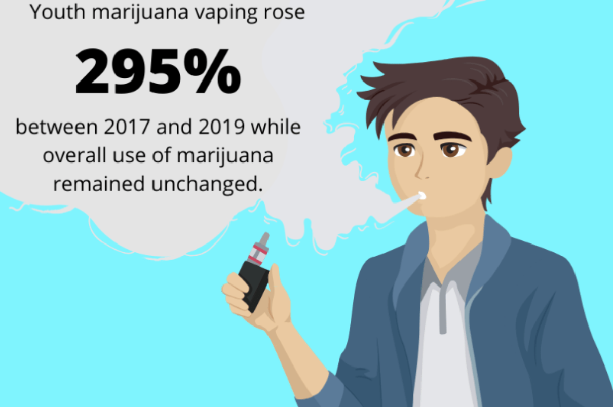

 

# Motivation & Related Work

 

<left> </left>

Vaping, the inhaling of a vapor created by vaping devices like e-cigarettes, was initially regarded as a less harmful substitution for cigarettes. However, vaping still introduces nicotine into the body. The prevalence of lung damage caused by vaping is actually so high that the CDC[[1](https://www.sciencedirect.com/science/article/pii/S2213260019304096?via=ihub)] needed to issue some guidance explicitly on it. According to the New York Post, a second vaping related death occured on November 9th, 2019. Overall, vaping has claimed at least 42 lives and injured over 2,000 others across the country[[2](https://nypost.com/2019/11/20/second-new-yorker-dead-from-vaping-related-illness-officials/)]. 

As the popularity of vaping grows, concerns about vaping are covered both in academia and in the press[[3](https://health.usnews.com/health-care/for-better/articles/2018-06-13/how-teenage-vaping-puts-structure-in-place-for-heroin-and-cocaine-addiction),[4](https://www.cnn.com/2015/09/04/us/vaping-abuse/index.html)]. A journal article published recently even describes the prevalence of vaping in a "red alert" state[[5](https://link.springer.com/article/10.1057/s41271-019-00193-2)]. In the press, vaping is accused of being both a  gateway drug and a new "drug" in itself. Moreover, 81% of Americans report teenagers who would not smoke cigarettes are using flavored e-cigarettes[[6](https://www.kff.org/other/issue-brief/data-note-vaping-and-e-cigarettes/)]. To provide grounds for potential public health interventions targeting this "scourge of drug"[[6](https://www.cnn.com/2015/09/04/us/vaping-abuse/index.html)], we evaluated the current landscape of vaping usage among teenagers and young adults in NYC using pre-collected data and analyzed the relationship between vaping and other drug usage with mental health and risky/violent behaviors.

  

# Data

We utilized the **YRBSS** dataset publicly available on [CDC.gov](https://www.cdc.gov/healthyyouth/data/yrbs/data.htm). For a description of the data please refer to the Data tab on the top right corner of this webpage.

  

# Research Questions

  

# More Vaping Facts

<br

Here are some useful links for your reference:

1.    [**5 Vaping Facts You Need to Know**](https://www.hopkinsmedicine.org/health/wellness-and-prevention/5-truths-you-need-to-know-about-vaping).

2.    [**Will Vaping Lead Teens to Smoking Cigarettes?**](https://www.hopkinsmedicine.org/health/wellness-and-prevention/does-vaping-lead-to-smoking).

3.    [**Vaping: What You Need to Know (Parents)**](https://kidshealth.org/en/parents/e-cigarettes.html)

