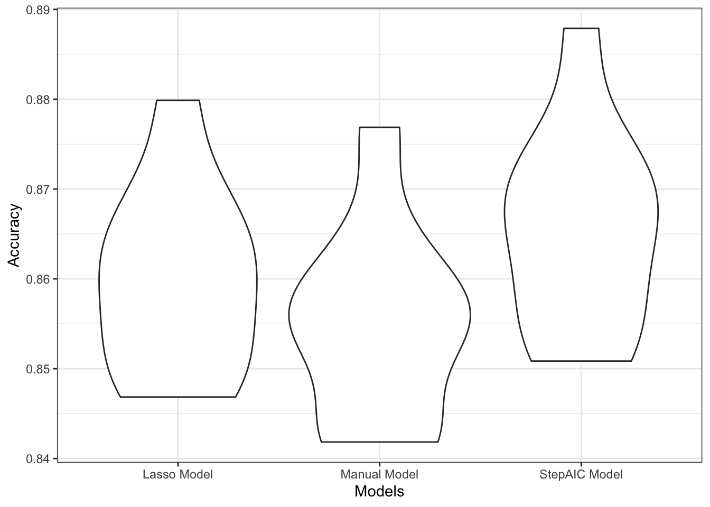

```{r setup, include=FALSE}
knitr::opts_chunk$set(echo = TRUE,
                      warning = FALSE,
                      message = FALSE,
                      fig.height = 5,
                      fig.width = 10)
library(tidyverse)
library(gganimate)
library(transformr)
library(gifski)
library(magick)
library(reprex)
library(modelr)
library(glmnet)
library(patchwork)
###This package provide glm like interface for glmnet
library(glmnetUtils)
set.seed(8105)

theme_set(theme_bw())
```
<br><br>

# Vaping - A new go-to drug?!
<br>
$Ying Chen_{yc384}$, $Jin Ge_{jg4197}$, $Daniela Quigee_{dq2147}$, $Han Sun_{hs3163}$, $Siquan Wang_{sw3442}$


<br>

# Motivation & Related Work

<br>

Vaping, the inhaling of a vapor created by vaping devices like e-cigarettes, was initially regarded as a less harmful substitution for cigarettes. However, vaping still introduces nicotine into the body. The prevalence of lung damage caused by vaping is actually so high that the CDC[[1](https://www.cdc.gov/mmwr/volumes/68/wr/mm6841e3.htm)] needed to issue some guidance explicitly on it. 

As the popularity of vaping grows, concerns about vaping are covered both in academia and in the press[[2](https://health.usnews.com/health-care/for-better/articles/2018-06-13/how-teenage-vaping-puts-structure-in-place-for-heroin-and-cocaine-addiction),[3](https://www.cnn.com/2015/09/04/us/vaping-abuse/index.html)]. A journal article published recently even describes the prevalence of vaping in a "red alert" state[[4](https://link.springer.com/article/10.1057/s41271-019-00193-2)]. In the press, vaping is accused of being both a  gateway drug and a new "drug" in itself. Moreover, 81% of Americans report teenagers who would not smoke cigarettes are using flavored e-cigarettes[[5](https://www.kff.org/other/issue-brief/data-note-vaping-and-e-cigarettes/)]. To provide grounds for potential public health interventions targeting this "scourge of drug"[[3](https://www.cnn.com/2015/09/04/us/vaping-abuse/index.html)], we evaluated the current landscape of vaping usage among teenagers and young adults in NYC using pre-collected data and analyzed the relationship between vaping and other drug usage with mental health and risky/violent behaviors.


<br>

**Quick Facts about vaping**

* According to the New York Post, a second vaping related death occured on November 9th, 2019. Overall, vaping has claimed at least 42 lives and injured over 2,000 others across the country[[6](https://nypost.com/2019/11/20/second-new-yorker-dead-from-vaping-related-illness-officials/)]. 

* 81% of Americans report teenagers who would not smoke cigarettes are using flavored e-cigarettes.[[7](https://www.kff.org/other/issue-brief/data-note-vaping-and-e-cigarettes/)]

* One pod of the most popular e-cigarette product -JUUL- contains 20 cigarettes worth of nicotine.[[8](https://truthinitiative.org/research-resources/emerging-tobacco-products/how-much-nicotine-juul)]


<br> <br>

# Initial Questions

<br>

We were interested in the following questions:

1. How has drug use changed over time in NYC's youth?

2. How have mental health related issues changed over time in NYC's youth?

3. How did drug use differ by sex in NYC's youth in 2017?

4. How did drug use differ by being involved in fights in NYC's youth in 2017?

5. Can we build a model with currently available data to predict future vaping use?
 
<br>

Initially, we were interested in building a model to determine associations. However, as our studies in data science class progressed further, we learned new great procedures and methods that we wanted to incorporate into our project. In particular, we became interested in building a predictive model (based on data from 2015), and using this model to predict vaping for 2017. 

It should be noted that question 3 and 4 were originally very general. With the help of Shiny, however, we were able to develop more focused questions of interest. 

<br> 

# Data

<br>

We utilized the **YRBSS** dataset publicly available on [CDC.gov](https://www.cdc.gov/healthyyouth/data/yrbs/data.htm). The Youth Risk Behavior Surveillance System (YRBSS) started in 1990 with the goal to monitor health behaviors that contribute markedly to the leading causes of death, disability, and social issues among youth and adults in the United States. The YRBSS monitors behaviors surrouning, for example,

* Alcohol and other drug use
* Tabacco use
* Unhealthy dietry behaviors
* Physical activity 
* Sexuality and birth control

The YRBSS contains national, state, territorial, tribal government, and local school-based surveys of representative samples of 9th to 12th grade students. Between 1991 and 2017, the YRBSS has gathered data from more than 4.4 million high school students in more than 1900 separate surveys. According to [CDC.gov](https://www.cdc.gov/healthyyouth/data/yrbs/overview.htm), the local surveys are representative of mostly public high school students in each juristiction.

Since the dataset is quite extensive - it contains national, state, and district wide data - we decided to focus on data from New York City and investigated youth behaviors related to drug use, risky and violent behaviors, as well as their mental health state.

In particular, we downloaded the [Districts(zip)](https://www.cdc.gov/healthyyouth/data/yrbs/data.htm) data in the Access file format. Subsequently, we used **Microsoft Access 2019**, to extract the data pertaining to the five boroughs of NYC. Since **Microsoft Access 2019** only allowed for a maximum of 65,000 observations to be exported as an Excel document at once, we ended up with five Excel documents - one for each borough. These datasets can be found [here](https://github.com/jg-97/p8105_final_project_vaping/tree/master/raw_data). Finally, we used R to combine these five datasets and to select variables of interest to us. These variables provided insights into drug usage behaviors, included risky and violent behaviors, and pertained towards mental health, and demographics. While picking suitable variables, we also took into account their response rates (i.e., we determined how many missing values are present in a certain variable in a particular year).

In the end, we worked with the following variables:

**Demographics**

* *borough*:   one of the five boroughs of NYC
* *year*:   year of the survey
* *age*:   age of the respondent
* *sex*:   gender of the respondent (male, female)
* *race7*:   race of the respondent

**Drug Use**

* *current_cigarette_use*:   respondent smoked cigarettes during the past 30 days   (Yes/No)
* *current_vaping*:   respondent used an electronic vapor product during the past 30 days   (Yes/No)
* *current_cigar_use*:   respondent smoked cigars, cigarillos, or little cigars during the past 30 days   (Yes/No)
* *current_alcohol_use*:   respondent had at least one drink of alcohol during the past 30 days   (Yes/No)
* *current_marijuana_use*:   respondent used marijuana during the past 30 days   (Yes/No)


**Mental Health**

* *sad_hopeless*:   during the past 12 months, respondent felt so sad or hopeless almost every day for two weeks or more in a row that doing some usual activities was impossible   (Yes/No)
* *attempted_suicide*:   during the past 12 months, respondent actually attempt suicide   (Yes/No)
* *injurious_suicide_attempt*:   respondent attempted suicide, during the past 12 months, resulting in an injury, poisoning, or overdose that had to be treated by a doctor or nurse   (Yes/No)
* *considered_suicide*:   during the past 12 months, respondent seriously considered attempting suicide   (Yes/No)


**Risky Behaviors/Violence**

* *safety_concerns_at_school*:  respondent did not went to school due to feeling unsafe at school or on way to or from school during the past 30 days   (Yes/No)
* *threatened_at_school*:  respondent has been threatened or injured with a weapon such as a gun, knife, or club on school property during the past 12 months   (Yes/No)
* *physical_fighting*:   respondent has been in a physical fight during the past 12 months   (Yes/No)
* *bullying_at_school*:   respondent has been bullied on school property during the past 12 months   (Yes/No)
* *bullying_electronically*:   respondent has been bullied electronically (i.e. facebook) during the past 12 months   (Yes/No)
* *illegal_injected_drug_use*: respondent has used needle to inject any illegal drug into body during life time   (Yes/No)
* *carring_weapon*:   respondent carried a weapon such as a gun, knife, or club during the past 30 days   (Yes/No)
* *sex_before_13*:   respondent had first sexual intercourse before age 13   (Yes/No)
* *current_sexual_activity*: respondent had sexual intercourse with 1 or more people during the past 3 months   (Yes/No)


<br> <br>


# Exploratory Analysis

<br>


```{r load_the_cleaned_data, include = FALSE}
### load the cleaned data
load("./data/nyc_data.RData")
nyc_drug <- df_total

```

## Exploring the change of Vaping and other drug use over Time

<br>

In order to analyze the change of vaping and other drug usage over time in NYC's youth, we created the following animated plots:

<br>

```{r distribution_vaping_other_drugs}
## filter the data used in this part
nyc_drug_used <- nyc_drug %>% 
  select(id, borough, year, 
         cigarette = current_cigarette_use, cigar = current_cigar_use,
         alcohol = current_alcohol_use, marijuana = current_marijuana_use,
         vaping = current_vaping) %>% 
  mutate(year = factor(year))

## cigarette proportion
cigarette <- nyc_drug_used %>% 
  filter(!is.na(cigarette)) %>% 
  group_by(year, borough) %>% 
  summarize(n = n(),
            cigarette = sum(cigarette == "Yes")/n) %>% 
  select(-n)

## cigar proportion
cigar <- nyc_drug_used %>% 
  filter(!is.na(cigar)) %>% 
  group_by(year, borough) %>% 
  summarize(n = n(),
            cigar = sum(cigar == "Yes")/n) %>% 
  select(-n) 

## alcohol proportion
alcohol <- nyc_drug_used %>% 
  filter(!is.na(alcohol)) %>% 
  group_by(year, borough) %>% 
  summarize(n = n(),
            alcohol = sum(alcohol == "Yes")/n) %>% 
  select(-n) 


## vaping proportion 
vaping <- nyc_drug_used %>% 
  filter(!is.na(vaping)) %>% 
  group_by(year, borough) %>% 
  summarize(n = n(),
            vaping = sum(vaping == "Yes")/n) %>% 
  select(-n) 

## marijuana proportion with all other proportions
marijuana_full <- nyc_drug_used %>% 
  filter(!is.na(marijuana)) %>% 
  group_by(year, borough) %>% 
  summarize(n = n(),
            marijuana = sum(marijuana == "Yes")/n) %>% 
  select(-n) %>% 
  left_join(cigarette, by = c("year", "borough")) %>% 
  left_join(cigar, by = c("year", "borough")) %>% 
  left_join(alcohol, by = c("year", "borough")) %>% 
  left_join(vaping, by = c("year", "borough")) %>% 
  pivot_longer(marijuana:vaping,
               names_to = "drug_type",
               values_to = "proportion")

drug_p <- marijuana_full %>%
  filter(!(is.na(proportion))) %>%
  ggplot(aes(x = year, y = proportion, color = borough, shape = drug_type, 
             group = interaction(borough, drug_type), frame = drug_type)) +
  geom_point(size = 2.2) + geom_path(size = .8) +
  labs(title = "{closest_state}",
       x = "Year",
       y = "Proportion of drug use",
       color = "Borough",
       shape = "Drug type") +
  theme(plot.title = element_text(size = 30, face = "bold"),
        axis.text = element_text(size = 15),
        axis.title = element_text(size = 15,face = "bold")) + 
  theme(legend.text = element_text(size = 10), legend.title = element_text(size = 15, face = "bold")) +  
  transition_states(drug_type, transition_length = 1, state_length = 3, wrap = TRUE) +
  enter_fade() + exit_fade()

animate(drug_p)
```

 

#### Interpretation
<br>

After analyzing the plots, we drew the following conclusions:

* Among the five types of drugs considered, alcohol has the highest proportion in year 2003, but started decreasing in use from 2007 onwards across all five boroughs in NYC. In addition, cigarette has a lower total proportion than alcohol but a similar decreasing trend after 2009. 

* Cigar maintains a steady but low-proportion trend during 2003-2017, which could be compared with marijuana holding a steady but higher proportion in total. Moreover, the marijuana use in Manhattan increased from the lowest level in 2007 to the highest level in 2011 among five boroughs. 

* Staten Island had the highest Marijuana use over the years among all five NYC boroughs. However, in year 2017, it dropped dramatically and had the lowest proportion among all boroughs. Overall Marijuana stayed almost the same among all boroughs over the years. 

* Vaping, which is our main drug of interest, has a slightly increasing trend from 2015-2017. This trend is quite similar to the alcohol, cigar and cigarette trend observed from 2003 to 2005. Moreover, vaping has a proportion about as high as the proportion observed in marijuana in 2015-2017, which indicates that it could possibliy grow into a new drug threatening public health.

<br> <br>

## Exploring the change of Mental Health over Time
<br>

In order to analyze the change of mental health status of NYC's youth over time, we created the following animated plots:

<br>

```{r distribution_mental_health}
## data for mental health disorder
nyc_drug_health <- nyc_drug %>% 
  select(id, year, borough, sad = sad_hopeless, 
         suicide = attempted_suicide, injury = injurious_suicide_attempt) %>% 
  mutate(year = factor(year))

## sadless
sad <- nyc_drug_health %>% 
  filter(!is.na(sad)) %>% 
  group_by(year, borough) %>% 
  summarize(n = n(),
            sad = sum(sad == "Yes")/n) %>% 
  select(-n)

## attempted suicide
suicide <- nyc_drug_health %>% 
  filter(!is.na(suicide)) %>% 
  group_by(year, borough) %>% 
  summarize(n = n(),
            suicide = sum(suicide == "Yes")/n) %>% 
  select(-n)

## injurious attempted suicide
injury_full <- nyc_drug_health %>% 
  filter(!is.na(injury)) %>% 
  group_by(year, borough) %>% 
  summarize(n = n(),
            injury = sum(injury == "Yes")/n) %>% 
  select(-n) %>% 
  left_join(sad, by = c("year", "borough")) %>% 
  left_join(suicide, by = c("year", "borough")) %>% 
  pivot_longer(injury:suicide,
               names_to = "mental_disorder",
               values_to = "proportion")

## animated plot
mental_p <- injury_full %>%
  filter(!(is.na(proportion))) %>% 
  ggplot(aes(x = year, y = proportion, color = borough, shape = mental_disorder, 
             group = interaction(borough, mental_disorder))) +
  geom_point(size = 2.2) + geom_path(size = .8) +
  labs(x = "Year",
       y = "Proportion of mental disorder",
       color = "Borough",
       shape = "Mental disorder") +  
  scale_shape_discrete(labels = c("injurious attempted suicide", "sad and hopeless", "attempted suicide")) +
  theme(axis.text = element_text(size = 15),
        axis.title = element_text(size = 15,face = "bold")) + 
  theme(legend.text = element_text(size = 10), legend.title = element_text(size = 15, face = "bold"))  +
  transition_states(mental_disorder, transition_length = 1, state_length = 3, wrap = TRUE) +
  enter_fade() + exit_fade()

animate(mental_p)

```


#### Interpretation
<br>

Examining these plots, we determined the following:

* Teenagers, feeling sad and hopeless, constitute the highest proportion among all three mental health issues considered. Based on the considered survey data, we see that a high percentage of teenagers do not have a positive mood. The trend decreases slightly after 2009, just to pick up again in 2015. Staten Island has the lowest proportion in the reported sadness with the exception of 2011. Bronx almost alwyas has the highest proportion, and Queens fluctuates greatly.

* The proportion of attempted suicide is approximately constant at about 0.1 and is higher than the proportion associated with getting injured due to an attempted suicide. Both attempted suicide and injurious attempted suicide are relatively steady over time and have about the same magnitude across all five NYC boroughs. 


<br> <br>

## Exploring drug use in 2017 by sex within each borough
<br>

We were interested in whether there is a difference in drug use between female and male teenagers in different boroughs in NYC in 2017. To that end, we created the following plots:

<br>

```{r Drug_Use_2017_by_Sex}
sex_plot = function(df, borough) {
df %>% 
  select(
    sex, 
    current_vaping, 
    current_cigarette_use, 
    current_cigar_use, 
    current_alcohol_use, 
    current_marijuana_use) %>% 
  pivot_longer(
    -sex,
    names_to = "drug",
    names_prefix = "current_",
    values_to = "status") %>% 
  mutate(
    drug = str_replace(drug, "_use", "")) %>%
  drop_na() %>% 
  group_by(
    drug,
    sex
  ) %>% 
  summarize(
    number = n()
  ) %>% 
  ungroup() %>% 
  group_by(drug) %>% 
  mutate(
    number_in_group = sum(number),
    percent = number / number_in_group) %>% 
  select(-number, -number_in_group) %>% 
  ggplot(aes(x = sex, y = percent, fill = sex)) + 
  geom_bar(stat = "identity") +
  labs(
    title = str_c("Drug Use in 2017 by Sex in ", borough),
    x = "sex",
    y = "proportion of drug use") + 
  theme(legend.position = "none") +
  facet_grid(~drug)}

sex_Bronx = sex_plot(nyc_drug %>% filter(year == "2017" & borough == "Bronx")," - The Bronx")
sex_Brooklyn = sex_plot(nyc_drug %>% filter(year == "2017" & borough == "Brooklyn"), " - Brooklyn")
sex_Manhattan = sex_plot(nyc_drug %>% filter(year == "2017" & borough == "Manhattan"), " - Manhattan")
sex_Queens = sex_plot(nyc_drug %>% filter(year == "2017" & borough == "Queens"), " - Queens")
sex_Staten_Island = sex_plot(nyc_drug %>% filter(year == "2017" & borough == "Staten Island"), " - Staten Island")
```


## {.tabset .tabset-fade .tabset-pills}

### **Bronx**
```{r echo=FALSE}
sex_Bronx
```

### **Brooklyn**
```{r echo=FALSE}
sex_Brooklyn
```

### **Manhattan**
```{r echo=FALSE}
sex_Manhattan
```

### **Queens**
```{r echo=FALSE}
sex_Queens
```

### **Staten Island**
```{r echo=FALSE}
sex_Staten_Island
```

## 

#### Interpretation
<br>

Studying these plots, we were able to derive the following results:

* According to our survey data, it appears as if independent of the type of drug the proportion of male teenagers in the Bronx using a particular type of drug is higher (about 0.55) compared to their female counterparts.

* According to our survey data, it appears as if independent of the type of drug the proportion of female teenagers in Brooklyn using a particular type of drug is higher (about 0.55) compared to their male counterparts.

* According to our survey data, it appears as if independent of the type of drug the proportion of female teenagers in Manhattan using a particular type of drug is higher (almost 0.60) compared to their male counterparts.

* According to our survey data, it appears as if independent of the type of drug the proportion of female teenagers in  Queens using a particular type of drug is about equal to the proportion of their male counterparts. A similar trend can be observed in Staten Island. However it seems as if marijuana use is slightly higher in female than in males teenagers in Staten Island.


<br><br>

## Exploring drug use in 2017 by being involved in fights
<br>

We were interested in whether there is a difference in drug use between teenagers involved in fights and teenagers not involved in fights in different boroughs of NYC in 2017. To that end, we created the following plots:

<br>

```{r Drug_Use_2017_by_Feeling_Sad_Hopeless}
fight_plot = function(df, borough) {
df %>% 
  select(
    physical_fighting, 
    current_vaping, 
    current_cigarette_use, 
    current_cigar_use, 
    current_alcohol_use, 
    current_marijuana_use) %>% 
  pivot_longer(
    -physical_fighting,
    names_to = "drug",
    names_prefix = "current_",
    values_to = "status") %>% 
  mutate(
    drug = str_replace(drug, "_use", "")) %>%
  drop_na() %>% 
  group_by(
    drug,
    physical_fighting
  ) %>% 
  summarize(
    number = n()
  ) %>% 
  ungroup() %>% 
  group_by(drug) %>% 
  mutate(
    number_in_group = sum(number),
    percent = number / number_in_group) %>% 
  select(-number, -number_in_group) %>% 
  ggplot(aes(x = physical_fighting, y = percent, fill = physical_fighting)) + 
  geom_bar(stat = "identity") +
  labs(
    title = str_c("Drug Use in 2017 by Being Involved in a Fight or Not ", borough),
    x = "involved in a fight",
    y = "proportion of drug use") +   
  theme(legend.position = "none") +
  facet_grid(~drug)}


fight_Bronx = fight_plot(nyc_drug %>% filter(year == "2017" & borough == "Bronx")," - The Bronx")
fight_Brooklyn = fight_plot(nyc_drug %>% filter(year == "2017" & borough == "Brooklyn"), " - Brooklyn")
fight_Manhattan = fight_plot(nyc_drug %>% filter(year == "2017" & borough == "Manhattan"), " - Manhattan")
fight_Queens = fight_plot(nyc_drug %>% filter(year == "2017" & borough == "Queens"), " - Queens")
fight_Staten_Island = fight_plot(nyc_drug %>% filter(year == "2017" & borough == "Staten Island"), " - Staten Island")
```


## {.tabset .tabset-fade .tabset-pills}

### **Bronx**
```{r echo=FALSE}
fight_Bronx
```

### **Brooklyn**
```{r echo=FALSE}
fight_Brooklyn
```

### **Manhattan**
```{r echo=FALSE}
fight_Manhattan
```

### **Queens**
```{r echo=FALSE}
fight_Queens
```

### **Staten Island**
```{r echo=FALSE}
fight_Staten_Island
```

## 

#### Interpretation
<br>

Studying these plots, we were able to derive the following result:

* According to our survey data, it appears as if independent of the type of drug the proportion of teenagers involved in a fight in the Bronx is about 0.28, with the exception of alcohol, for which the proportion seems to be about 0.25.

* The same trend can be observed in Brooklyn. The only differences appear to be that the proportions itself are a bit lower: 0.22 for alcohol and about 0.25 for the remaining types of drugs.

* According to our survey data, it appears as if independent of the type of drug the proportion of teenagers involved in a fight in Manhatten is about 0.22.

* According to our survey data, it appears as if the proportion of teenagers involved in a fight in Queens is slightly higher for children vaping (about 0.24) and smoking cigars (about 0.23). 

* According to our survey data, it appears as if independent of the type of drug the proportion of teenagers involved in a fight in Staten Island is about 0.19 - the lowest proportion of all boroughs.

<br>

**If this Exploratory Analysis sparked your interested, feel free to explore the data more using the Explore the Data tab on the top right corner of the website.**


<br> <br>

# Logistic Regression Models

<br>


Since we were investigating the prevelance and trend in vaping among NYC's youth, we were interested in predicting **current_vaping**. We began our model building process considering the following predictors:

**Demographics**

* *borough*:   one of the five boroughs of NYC
* *age*:   age of the respondent
* *sex*:   gender of the respondent (male, female)
* *race7*:   race of the respondent

**Mental Health**

* *sad_hopeless*:   during the past 12 months, respondent felt so sad or hopeless almost every day for two weeks or more in a row that doing some usual activities was impossible   (Yes/No)
* *attempted_suicide*:   during the past 12 months, respondent actually attempt suicide   (Yes/No)
* *injurious_suicide_attempt*:   respondent attempted suicide, during the past 12 months, resulted in an injury, poisoning, or overdose that had to be treated by a doctor or nurse   (Yes/No)
* *considered_suicide*:   during the past 12 months, respondent seriously considered attempting suicide   (Yes/No)


**Risky Behaviors/Violence**

* *safety_concerns_at_school*:  respondent did not went to school due to feeling unsafe at school or on way to or from school during the past 30 days   (Yes/No)
* *threatened_at_school*:  respondent has been threatened or injured with a weapon such as a gun, knife, or club on school property during the past 12 months   (Yes/No)
* *physical_fighting*:   respondent has been in a physical fight during the past 12 months   (Yes/No)
* *bullying_at_school*:   respondent has been bullied on school property during the past 12 months   (Yes/No)
* *bullying_electronically*:   respondent has been bullied electronically (i.e. facebook) during the past 12 months   (Yes/No)
* *illegal_injected_drug_use*: respondent has used needle to inject any illegal drug into body during life time   (Yes/No)
* *carring_weapon*:   respondent carried a weapon such as a gun, knife, or club during the past 30 days   (Yes/No)
* *sex_before_13*:   respondent had first sexual intercourse before age 13   (Yes/No)
* *current_sexual_activity*: respondent had sexual intercourse with 1 or more people during the past 3 months   (Yes/No)

<br> <br>

## Manuel Method

<br>

First, we attempted to find a predictive model by using a variation on **stepwise/automatic procedures** (by hand). We utilized p-values and prediction accuracy as our guidance for which predictors to choose, starting with the full model. 


```{r Manuel_Method, eval = FALSE}
# Fitting a logistic regression model
fit_logistic = glm(current_vaping ~ sad_hopeless  + attempted_suicide + safety_concerns_at_school + illegal_injected_drug_use + physical_fighting + bullying_electronically + carring_weapon + sex_before_13 , data = df, family = binomial(),na.action = na.omit)

# Looking at the model coefficients
fit_logistic %>% 
  broom::tidy() %>% 
  mutate(OR = exp(estimate)) %>%
  knitr::kable(digits = 3)
```

```{r Model_Criteria, eval = FALSE}
# What is the contribution of each predictor? see: https://uc-r.github.io/logistic_regression#multi
caret::varImp(fit_logistic)

# Cross-Validating the model
data_train <- trainControl(method = "cv", number = 5)

model_caret <- train(
  current_vaping ~ sad_hopeless  + attempted_suicide + safety_concerns_at_school + threatened_at_school + physical_fighting + bullying_electronically + carring_weapon,
                   data = df,
                   trControl = data_train,
                   method = 'glm',
                   family = binomial(),
                   na.action = na.pass)
  
model_caret
AIC(fit_logistic)


fit_logistic$formula
```

In the end, this process came up with the following possible model:

<br>
**Model 1**

current_vaping ~ sad_hopeless + attempted_suicide + safety_concerns_at_school + illegal_injected_drug_use + physical_fighting + bullying_electronically + carring_weapon + sex_before_13

<br> <br>


## Step AIC Method

<br>

Considering the large number of predictor candidates in our model, we decided to take advantage of the existing modern computational power and use the stepwise regression method to come up with a model. We used the AIC criterion, a goodness of fit measure that helps to avoid overfitting. It also circumvents the big p value problem introduced by our potentially highly correlated predictor candidates.
The actual function used is the StepAIC function from the MASS package.

```{r eval = FALSE}

###Defining a glm object that contains the regression model generated
auto_logistic = glm(
  ###Fixing "current_vaping" as response,whith all the vairble candidtates as pridictors.
  current_vaping ~., data = df, 
  ###Runing logistics regression, with complete analysis
  family = binomial(),na.action = na.omit) %>%
  ###Choose a model by AIC in a Stepwise Algorithm
  MASS::stepAIC(trace = FALSE)

AIC(auto_logistic)

auto_logistic %>% broom::tidy()
auto_logistic$formula
```


The formula generated by the function is as follows:

<br>
**Model 2**

current_vaping ~ carring_weapon + sad_hopeless + attempted_suicide + 
   safety_concerns_at_school + physical_fighting + bullying_electronically + 
    age + race7 + illegal_injected_drug_use + sexual_contact_2


<br><br>

## LASSO Method

<br>

The motivation behind using the LASSO method is that we have a lot of potential predictors available and we cannot (and do not want to) to do an exhaustive search manually. LASSO is a shinkage method that avoids overfitting and help with variable selection. These advantages make LASSO one of the most popular methods in regression problem settings. In our study we chose the penalty parameter lamda based on the cross-validation error. Then we used the optimal lamda to rerun the LASSO again to get our final model.

```{r eval = FALSE}
###Defining a glmnet object that contains the cv lasso model generated to find the best lambda to use
  lasso_temp = cv.glmnet(
  ###Fixing "current_vaping" as response,whith all the vairble candidtates as pridictors.
    current_vaping ~., data = df, 
    ###Runing for logistics outcom
    family = "binomial")

###Defining a glmnet object that contains the final lasso model using the best lambda generated
  lasso_logistic = glmnet(
  ###Fixing "current_vaping" as response,whith all the vairble candidtates as pridictors.
    current_vaping ~., data = df, 
    ###Runing for logistics outcom
    family = "binomial",
    ### With the best lambda
    lambda = lasso_temp$lambda.min
    )
```

In the end the final model from LASSO is the following:

<br>
**Model 3:** 

current_vaping ~ age + sex + race7 + sad_hopeless + attempted_suicide + injurious_suicide_attempt + safety_concerns_at_school + physical_fighting + bullying_electronically + illegal_injected_drug_use + carring_weapon + sex_before_13 + current_sexual_activity

<br>
The LASSO model has tunning paramter lamda equals 0.005 and the model contains more covariates than the above two models since LASSO putting shringkage on the coefficient of each covariate and thus will include more covariates (remember that LASSO will automatically do the variable selection).


<br>


## Model Selection 
<br>

### Picking the "best" Model
<br>

At this point we had three predictive models. In order to decide which of them is the "best" one, we employed the cross-validation prediction accuracy as our criterion. The prediction accuracy is calculated as the proportion of correct predictions made by the model.

To perform the cross-validation in a compact and well-integrated manner, we coded our model selection process as robust functions that can be mapped to a modlr cv object by purrr to streamline the cross-validation process. We conducted a 5 fold 10 times CV on the three models.


```{r }
## function for stepAIC method
log_reg_auto = function(cv_df){
  cv_df %>% mutate(
###Automodel selection with AIC as criterial
         automodel  = map(train, ~glm(current_vaping ~., data = .x, family = binomial(),na.action = na.exclude)%>%MASS::stepAIC(trace = FALSE))
 ) }

###function for lasso selection method
lasso = function(df){
  lasso_temp = cv.glmnet(current_vaping ~., data = df, family = "binomial")
glmnet(current_vaping ~., data = df, family = "binomial",lambda = lasso_temp$lambda.min)
}
### formular for manual selection
manual_formular = current_vaping ~ sad_hopeless + attempted_suicide + safety_concerns_at_school + 
    threatened_at_school + physical_fighting + bullying_electronically + 
    carring_weapon

###find prediction accuracy
accy = function(model,data){
  Temp = predict(model, data, type = "response") %>% round()
1 - mean(Temp - (as.numeric(pull(as.tibble(data),current_vaping)) - 1))
}
```

```{r include=FALSE}

load("./data/nyc_data.RData")

# Creating the dataset we will use to build the model
df = df_total %>% 
  ### Select only the vairbale candidates from the data set 
  select(
    # binary respone
    current_vaping,
    # possible predictor
    borough,
    year,
    age,
    sex,
    race7,
    sad_hopeless,
    attempted_suicide,
    injurious_suicide_attempt,
    considered_suicide,
    safety_concerns_at_school,
    threatened_at_school,
    physical_fighting,
    bullying_at_school,
    bullying_electronically,
  illegal_injected_drug_use,
    carring_weapon,
    sex_before_13,
    current_sexual_activity)


df15 = df %>% filter(year == 2015) %>% 
  ###Wanna do complete analysis
  drop_na()

df17 = df %>% filter(year == 2017) %>% 
  ###Wanna do complete analysis
  drop_na()

```


```{r eval=FALSE}
cv_df=
  ## Making the CV_df by modelr, for 5 folds and 10 times.
  crossv_mc(df15,n=10)


cv_df = cv_df%>%
##stepAIC
  log_reg_auto()%>%
  ## Manual model
  mutate(manual_model = map(train, ~glm(manual_formular, data = .x, family = binomial,na.action = na.exclude)))%>%
  ## Lasso model
 mutate(lasso_model = map(train,~lasso(.x)))

###Prediction Accuracy computation
cv_df = cv_df%>%
  mutate(
        accuracy_automodel= map2_dbl(.x = automodel,.y = test, ~accy(data =.y,model =.x)),
        accuracy_manualmodel= map2_dbl(.x = manual_model,.y = test, ~accy(data =.y,model =.x)),
        accuracy_lasso= map2_dbl(.x = lasso_model,.y = test, ~accy(data =.y,model =.x))
        )


###Graph accuracy distribution
cv_df%>%select(starts_with("accuracy")) %>% 
  pivot_longer(
    everything(),
    names_to = "model", 
    values_to = "Accuracy",
    names_prefix = "accuracy_") %>% 
  mutate(Models = recode(model,automodel = "StepAIC Model",manualmodel = "Manual Model", lasso = "Lasso Model"))%>%
  ggplot(aes(x = Models, y = Accuracy)) + geom_violin()
```
<br>

<left> </left>


According to the violin plot, which shows the distribution of prediction accuracy, the model that was generated by stepAIC (StepAIC model) has an accuracy of about 1% better than the accuracy of the model generated by lasso (Lasso model) and an accuracy of about 2% better than the model generated by the manual selection (Manual model) method. Therefore, we picked the stepAIC model as our finial model.


<br>

### Model applied to 2017 Data

<br>

Subsequently, we used all three models to predict the vaping status of teenagers in 2017. As can be seen in the table below, the StepAIC model also performed best among the three models considered, giving a more than 87% accuracy rate. 


```{r }
## The model generated using the full data set is recreated
Final_model =
  ## tibble
  tibble(train = list(df15),
         test = list(df17)) %>%
  ##stepAIC
  log_reg_auto() %>%
  ## Manual model
  mutate(manualmodel = map(train, ~glm(manual_formular, data = .x, family = binomial,na.action = na.exclude))) %>%
  ## Lasso model
  mutate(lassomodel = map(train,~lasso(.x)))
```

```{r }
Final_model %>%
  mutate(
        accuracy_automodel = map2_dbl(.x = automodel,.y = test, ~accy(data =.y,model =.x)),
        accuracy_manualmodel = map2_dbl(.x = manualmodel,.y = test, ~accy(data =.y,model =.x)),
        accuracy_lasso = map2_dbl(.x = lassomodel,.y = test, ~accy(data =.y,model =.x))
        ) %>%
  select("Accuracy StepAIC Model"=accuracy_automodel, "Accuracy Manual Model" = accuracy_manualmodel, "Accuracy Lasso Model"= accuracy_lasso) %>% round(digits = 3) %>% knitr::kable(caption = "Prediction Accuray by Model on 2017 data")
```


<br>

In conclusion, the final logistic regression model (StepAIC model) has the following formulae:

**current_vaping ~ carring_weapon + sad_hopeless + attempted_suicide + safety_concerns_at_school + physical_fighting + bullying_electronically + age + race7 + illegal_injected_drug_use + sexual_contact_2**

<br><br>


# Discussion
<br>
Vaping, no doubt, is getting not just press attention, but is also a public health crisis in youth. How to use current available data to prevent future vaping use in youth is an urgent task for public health researchers. After visualizing the YRBSS data, we proposed three different models using data in 2015 to predict youth vaping use in 2017. We used prediction accuracy in cross-validation (CV) as the criterion to choose the best predicting model. By conducting a 5 folds 10 times CV, the model that was generated by StepAIC outstood the manually created and the LASSO selected models. The StepAIC model picked 10 predictors (carring_weapon, sad_hopeless, attempted_suicide, safety_concerns_at_school, physical_fighting, bullying_electronically, age, ace7, illegal_injected_drug_use and sexual_contact_2) and gives an overall of 87% accuracy rate. Overall, teenagers with a depressive mood, who are suffering from depression, who have problems in school and exhibit risky behaviors are more likely to start vaping at a young age. 

<br> 

The limitation of this dataset is that we only have vaping data for two years. In addition to that, we had to drop some potential predictors due to high levels of missingness.  Despite this, our findings are important. We wish to apply our methods to data from 2018 and 2019, when they become publicly available. Should the prediction accuracy rate stay high, it will help policy makers, schoolteachers, and parents to work together to focus on a targeted population to improve efficiency in reducing the vaping rate in youth. 

<br> 

We thank Dr. Jeff Goldsmith and his TA team for helping us and giving us this opportunity to work together to actually trying to solve some real public health issues. We hope that you have enjoyed watching our screencast and going through the work that we presented here. 
<br>

